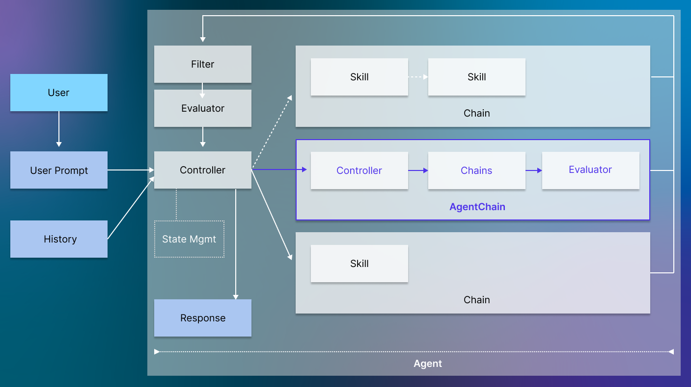

<h1><p align="center">Council: AI Agent Platform with Control Flow and Scalable Oversight</p></h1>


[](https://opensource.org/licenses/Apache-2.0)
[](https://badge.fury.io/py/council-ai)
[](https://discord.gg/DWNCftGQZ3)
[](https://council.dev)

# Welcome

**Council** is an open-source platform for the rapid development and robust deployment of customized generative AI applications using teams of `agents` - built in Python and (soon) Rust.

Council extends the LLM tool ecosystem by enabling advanced control and scalable oversight for AI agents. Users can create sophisticated agents with predictable behavior by leveraging Council's powerful approach to control flow using Controllers, Filters, Evaluators and Budgets for agents. This allows the automated routing between agents, comparing, evaluating and selecting the best results for a (sub-)task. 

The framework provides connectivity to a wide variety of Large Language Models (LLMs) natively and by integrating with popular libraries such as LangChain.

**Council** aims to facilitate packaging and seamlessly deploying Agents at scale on multiple deployment platforms while enabling enterprise-grade monitoring and advanced quality control in a future release (contributions are welcome).


# Key Features

* 🧐 **Support for Sophisticated Agents**: Reliable agents that can iterate over tasks that require exploring alternatives, creating and completing subgoals, and evaluating quality under budget constraints.
* 🥰 **Built for Data Scientists**: Python library, local development environment, integrated with popular frameworks.
* 🚀 **Seamless Production Deployments**: Easy packaging, deployment and monitoring at scale on multiple deployment platforms via Kubernetes integration.
* 🤝 **Ecosystem Connectivity**: Connected with a growing AI Agent ecosystem, integrated with LangChain, LlamaIndex and leading AI models.
* 👮 **Scalable Oversight**: Built-in tooling to manage, version, monitor, evaluate and control deployed Agents.

Note: Some of the features listed above are work-in-progress and due in a future release.

# Key Concepts

Key components of the framework are shown in below image and further introduced in this section.



## Agent
Agents encapsulate the end-to-end application logic from prompt input to final response across Controller, Evaluation and registered Chains of Skills. Agents itself can be recursively nested within other Agents in the form of AgentChains.

## Controller
Controllers determine user intent given a prompt and prompt history and route the prompt to one or multiple of registered Chains before leveraging one or multiple Evaluators to score returned results and determine further course of action (including the ability to determine whether a revision is needed in which case Chains might be prompted again). Controllers will control whether one or multiple Chains are called, whether calls happen in series or in parallel. They will also be responsible for the distribution of compute budget to Chains and handling Chains that are not able to return results within the allocated compute budget. A State Management component will allow Controllers to save and retrieve state across user sessions. Controllers can be implemented in Python or (soon) Rust (to meet the needs of performance-critical applications).

## Skill
Skills are services that receive a prompt / input and will return an output. Skills can represent a broad range of different tasks relevant in a conversational context. They could wrap general purpose calls to publicly available language model APIs such as OpenAI’s GPT-4, Anthropic’s Claude, or Google’s Bison. They could also encapsulate locally available smaller language models such as Stable-LM and Cerebras-GPT, or serve more specific purposes such as providing interfaces to application-specific knowledge bases or generate application-aware code snippets. 

## Chain
Chains are directed graphs of Skills that are co-located and expose a single entry point for execution to Controllers. Users will be able to define their own Chains or reuse existing implementations. Chains themselves can be Agents that are recursively nested into the execution of another Agent as AgentChain.

## Evaluator 
Evaluators are responsible for assessing the quality of one or multiple Skills / Chains at runtime for example by ranking and selecting the best response or responses that meet a given quality threshold. This can happen in multiple ways and is dependent on the implementation chosen. Users can extend standard Evaluators to achieve custom behavior that best matches their requirements. 

## Filter 
Filters are responsible for filtering responses given back to the controller. 

## State Management
Council provides native objects to facilitate management of Agent, Chain and Skill context. These objects make it easy to keep track of message history and intermediate results.

# Quickstart

## Installation

Install Council in one of multiple ways:

1. (Recommended) Install with pip via Pypi: `pip install council-ai`
2. Install with pip from git ref: `pip install git+https://github.com/chain-ml/council.git@<branch_name>`
   - More documentation here: https://pip.pypa.io/en/stable/topics/vcs-support/#git
3. Install with pip from local copy: 
   - Clone this repository
   - Navigate to local project root and install via `pip install -e git+https://github.com/chain-ml/council.git@<branch_name>.`

Uninstall with: `pip uninstall council-ai`

### Current Stable Version
<a href="https://pypi.org/project/council-ai/#history"></a>


## Setup

Set up your required API keys in a `.env`  (e.g. OpenAI). Refer to `.env.example` as an example. 

## Usage

Import Council.

```python
from council.chains import Chain
from council.skills import LLMSkill
from council.llm import OpenAILLM
```

Setup API keys in .env file (example in repository) and use it to set up the LLM here: <a href="https://openai.com/">OpenAILLM</a>

```python
import dotenv

dotenv.load_dotenv()
openai_llm = OpenAILLM.from_env()
```

Create your first Hello World Skill and Wrap it in a Chain.

```python
prompt = "You are responding to every prompt with a short poem titled hello world"
hw_skill = LLMSkill(llm=openai_llm, system_prompt=prompt)
hw_chain = Chain(name="Hello World", description="Answers with a poem about titled Hello World", runners=[hw_skill])
```

Create a second Skill (that responds only with Emojis).

```python
prompt = "You are responding to every prompt with an emoji that best addresses the question asked or statement made"
em_skill = LLMSkill(llm=openai_llm, system_prompt=prompt)
em_chain = Chain(name="Emoji Agent", description="Responds to every prompt with an emoji that best fits the prompt",
                 runners=[em_skill])
```

Create a Controller to route prompts to chains. Here we use the straight-forward LLMController in which an LLM instance is tasked to make a routing decision.

```python
from council.controllers import LLMController

controller = LLMController(llm=openai_llm, chains=[hw_chain, em_chain], response_threshold=5)
```

Create an Evaluator. Here, we use an LLMEvaluator in which an LLM is tasked to evaluate each response received.

```python
from council.evaluators import LLMEvaluator

evaluator = LLMEvaluator(llm=openai_llm)
```

Finalize setup of the Hello World first Agent by combining all components created.


```python
from council.agents import Agent
from council.filters import BasicFilter

agent = Agent(controller=controller, evaluator=evaluator, filter=BasicFilter())
```

Now, we are ready to invoke the agent.

```python
result = agent.execute_from_user_message("hello world?!")
print(result.best_message.message)
```

## Linter

Use `make lint` to verify your code.

## Black

Use `black .` to automatically reformat files.

# Documentation

A detailed documentation of Council can be found at <a href="https://council.dev">council.dev</a>.

# Support

Please submit a GitHub issue should you need any help or reach out to the team via <a href="https://discord.gg/DWNCftGQZ3">Discord</a>.

# Contributors

Council is a project under active development. We welcome all contributions, pull requests, feature requests or reported issues.

# Community

Join our Discord community to connect with the core development team and users <a href="https://discord.gg/DWNCftGQZ3">here</a>.

