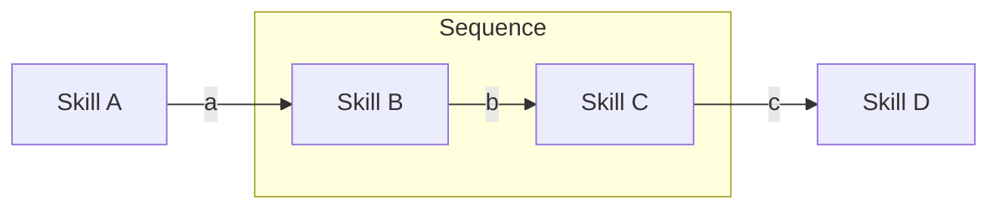
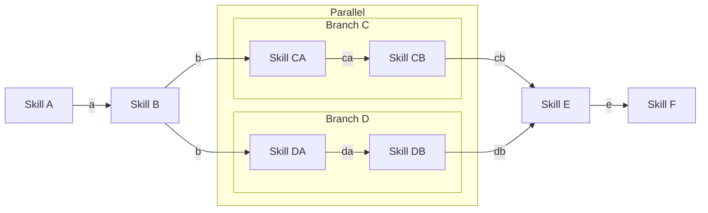
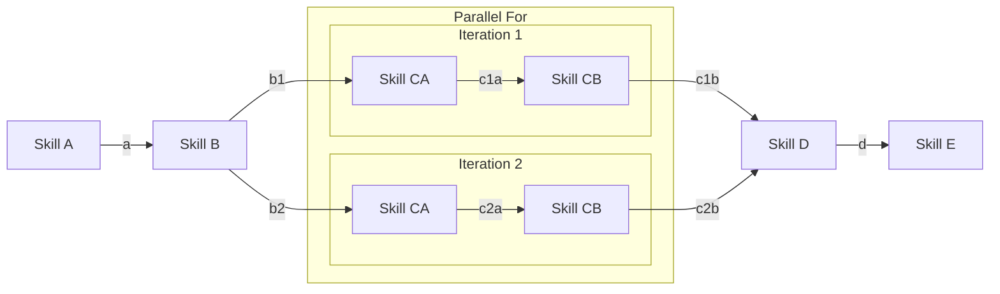
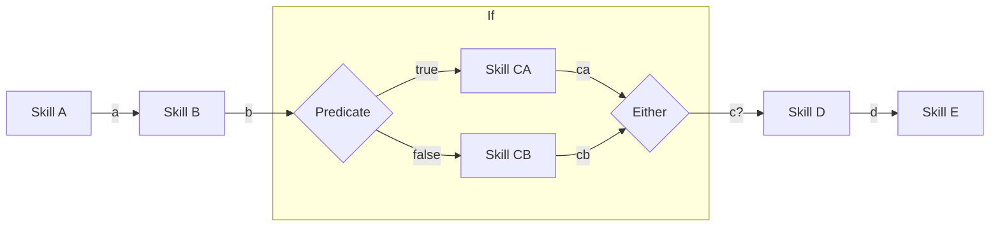
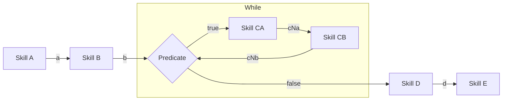
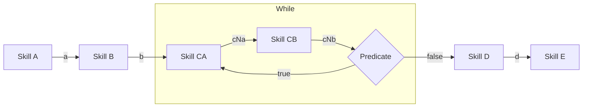
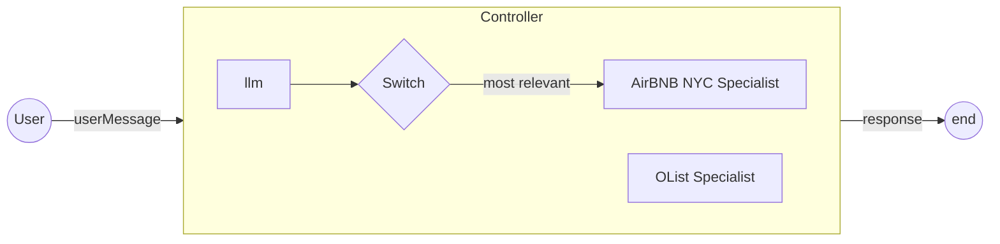
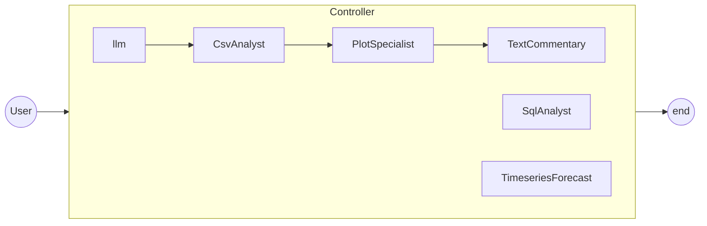

# Proposed Design Update

- Skills: 
  - it consumes from the context and provides a new message(s). It has a clear scope and responsibility, similar to a function
  - it does not modify the context (Input is readonly context, Output is a List of messages)
- Runners:
  - Used to define a graph of operation (if, sequence or chain, parallel, while, ...)
  - Manage `context` update and ensure thread safety
  - new `Controller`? (as in flow controller, or control flow)
- Chain: 
  - would become `runner` + description
  - new `Agent`???
- Controller
  - would become a `runner`
- Evaluator
  - would become a _many to many_ skill
- Filter
  - would become a _many to many_ skill
- Agent 
  - is too complex
  - constraint workflow
  - would be removed in favor of the new `runner`/`controller`

## Design Goals

- Thread Safe
- 1 constraint => 1 or more benefits
- composability

## Categories

- one to one
- one to many
- many to one
- many to many

## Sequential


In the scenario, each skill takes one message as input, and produces one message as output. 

| skill   | visible messages | last message |
|---------|------------------|--------------|
| Skill A | -                | -            |
| Skill B | a                | a            |
| Skill C | a, b             | b            |
| Skill D | a, c             | c            |

## Parallel

It executes multiple branches against the same input message.
This is helpful to explore different execution strategies.



This scenario leverages different types of skills:
- `Skill E` is a _many to one_ skill: multiple inputs, single outputs. It fans in
- All other skills are _one to one_ skills: one input, one output

| skill    | visible messages | last message(s) |
|----------|------------------|-----------------|
| Skill A  | -                | -               |
| Skill B  | a                | a               |
| Skill CA | a, b             | b               |
| Skill CB | a, b, ca         | ca              |
| Skill DA | a, b             | b               |
| Skill DB | a, b, da         | da              |
| Skill E  | a, b, cb, db     | cb, db          |
| Skill F  | a, b, e          | e               |

## Parallel For

It executes the same runner for each input message.



This scenario leverages different types of skills:
- `Skill B` is a _one to many_ skill: one input, multiple outputs. It fans out
- `Skill D` is a _many to one_ skill: multiple inputs, single outputs. It fans in
- All other skills are _one to one_ skills: one input, one output


| skill     | visible messages | last message(s) |
|-----------|------------------|-----------------|
| Skill A   | -                | -               |
| Skill B   | a                | a               |
| Skill C1A | a, b1            | b1              |
| Skill C1B | a, b1, c1a       | c1a             |
| Skill C2A | a, b2            | b2              |
| Skill C2B | a, b2, c2a       | c2a             |
| Skill D   | a, c1b, c2b      | c1b, c2b        |
| Skill E   | a, d             | d               |


## If

Runs one skill if a given predicate returns `True`; another skill otherwise.



Here, `Skill D` is a _one to one_ skill as it receives either `ca` or `cb` as input, never both.

| skill    | visible messages    | last message(s) |
|----------|---------------------|-----------------|
| Skill A  | -                   | -               |
| Skill B  | a                   | a               |
| Skill CA | a, b                | b               |
| Skill CB | a, b                | b               |
| Skill D  | a, b, (ca or cb)    | ca or cb        |
| Skill E  | a, b, (ca or cb), d | d               |

## While

Runs a skill as long as a given predicate is `true`. The predicate executes at the beginning of the iteration




| skill    | visible messages                      | last message(s) |
|----------|---------------------------------------|-----------------|
| Skill A  | -                                     | -               |
| Skill B  | a                                     | a               |
| Skill CA | a, b                                  | b               |
| Skill CB | a, b, c1a                             | c1a             |
| Skill CA | a, b, c1a, c1b                        | c1b             |
| Skill CB | a, b, c1a, c1b, c2a                   | c2a             |
| ...      | ...                                   | ...             |
| Skill CA | a ,b, c1a, c1b, c2a, c2b, ... c(N-1)b | c(N-1)b         |
| Skill CB | a, b, c1a, c1b, c2a, c2b, ... cNa     | cNa             |
| Skill D  | a, b, CNb                             | cNb (or b)      |
| Skill E  | a, b, cNb, d                          | d               |

## DoWhile

Runs a skill as long as a given predicate is `true`. The predicate executes at the end of the iteration




| skill    | visible messages                      | last message(s) |
|----------|---------------------------------------|-----------------|
| Skill A  | -                                     | -               |
| Skill B  | a                                     | a               |
| Skill CA | a, b                                  | b               |
| Skill CB | a, b, c1a                             | c1a             |
| Skill CA | a, b, c1a, c1b                        | c1b             |
| Skill CB | a, b, c1a, c1b, c2a                   | c2a             |
| ...      | ...                                   | ...             |
| Skill CA | a ,b, c1a, c1b, c2a, c2b, ... c(N-1)b | c(N-1)b         |
| Skill CB | a, b, c1a, c1b, c2a, c2b, ... cNa     | cNa             |
| Skill D  | a, b, cNb                             | cNb             |
| Skill E  | a, b, cNb, d                          | d               |

# Controller

A Controller is a dynamic runner: the graph of execution depends on the context. It has two main execution steps:
- building a graph of execution (or an execution plan). This produce a `runner`
- executing it

A `controller` is a `runner` by contract (executing a graph for a given context), it shares the same benefits as any other `runner`, including:
- traceability via the `context`
- logging via the `context`
- composability into complex graph of execution

```Python
class ControllerRunnerBase(RunnerBase):
    def _execute(self, context) -> List[Message]:
      return self.build_runner(context).execute(context).last_messages()
    
    def build_runner(self, context) -> Runner :
      pass
    
class PlanControllerRunner(ControllerRunnerBase):
    def build_runner(self, context) -> Runner:
        plan = self.get_plan()
        return self.build_runner_from_plan(plan)

    def get_plan(self) -> List[ExecutionUnit]:
        pass

class AgentRunner(PlanControllerRunner):
    def build_runner(self, context) -> Runner:
      runner = super().build_runner()
      return DoWhile(sequence(runner, filter, evaluator))
        
```

Below are a few examples of controller execution flow.

## Switch Controller

From a set of runners, pick one and execute it


## Tool Controller

From a set of runners, consume them as chainable tools to achieve a greater goal

