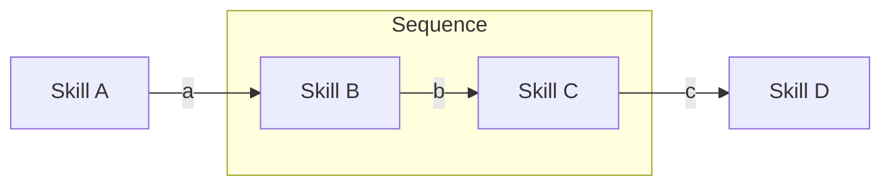
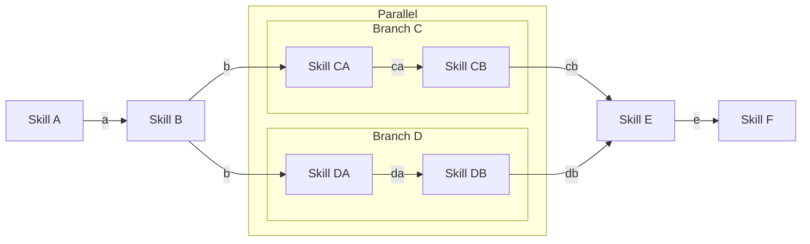
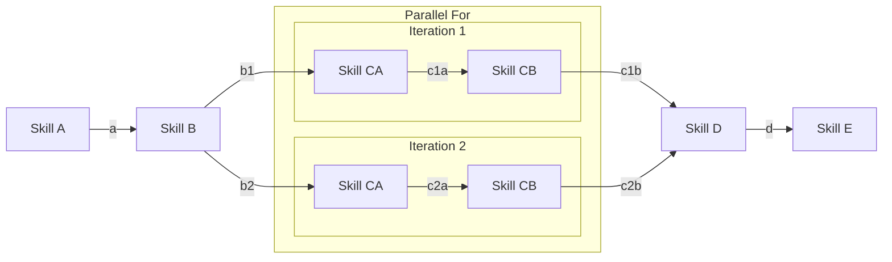
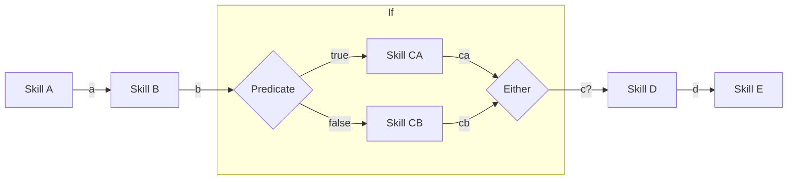
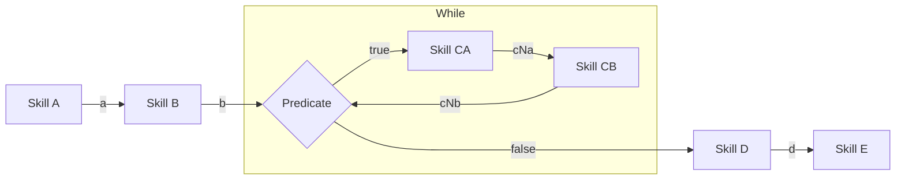
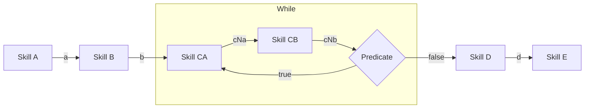

# Runners

## Sequential

In the scenario, each skill takes one message as input, and produces one message as output. 

| skill   | visible messages | last message |
|---------|------------------|--------------|
| Skill A | -                | -            |
| Skill B | a                | a            |
| Skill C | a, b             | b            |
| Skill D | a, b, c          | c            |

## Parallel

It executes multiple branches against the same input message.
This is helpful to explore different execution strategies.

This scenario leverages different types of skills:
- `Skill E` is a _many to one_ skill: multiple inputs, single outputs. It fans in
- All other skills are _one to one_ skills: one input, one output

| skill    | visible messages | last message(s) |
|----------|------------------|-----------------|
| Skill A  | -                | -               |
| Skill B  | a                | a               |
| Skill CA | a, b             | b               |
| Skill CB | a, b, ca         | ca              |
| Skill DA | a, b             | b               |
| Skill DB | a, b, da         | da              |
| Skill E  | a, b, cb, db     | cb, db          |
| Skill F  | a, b, e          | e               |

## Parallel For

It executes the same runner for each input message.

This scenario leverages different types of skills:
- `Skill B` is a _one to many_ skill: one input, multiple outputs. It fans out
- `Skill D` is a _many to one_ skill: multiple inputs, single outputs. It fans in
- All other skills are _one to one_ skills: one input, one output

| skill     | visible messages | last message(s) |
|-----------|------------------|-----------------|
| Skill A   | -                | -               |
| Skill B   | a                | a               |
| Skill C1A | a, b1            | b1              |
| Skill C1B | a, b1, c1a       | c1a             |
| Skill C2A | a, b2            | b2              |
| Skill C2B | a, b2, c2a       | c2a             |
| Skill D   | a, c1b, c2b      | c1b, c2b        |
| Skill E   | a, d             | d               |

## If

Runs one skill if a given predicate returns `True`; another skill otherwise.

Here, `Skill D` is a _one to one_ skill as it receives either `ca` or `cb` as input, never both.

| skill    | visible messages    | last message(s) |
|----------|---------------------|-----------------|
| Skill A  | -                   | -               |
| Skill B  | a                   | a               |
| Skill CA | a, b                | b               |
| Skill CB | a, b                | b               |
| Skill D  | a, b, (ca or cb)    | ca or cb        |
| Skill E  | a, b, (ca or cb), d | d               |

## While

Runs a skill as long as a given predicate is `true`. The predicate executes at the beginning of the iteration

| skill    | visible messages                        | last message(s) |
|----------|-----------------------------------------|-----------------|
| Skill A  | -                                       | -               |
| Skill B  | a                                       | a               |
| Skill CA | a, b                                    | b               |
| Skill CB | a, b, c1a                               | c1a             |
| Skill CA | a, b, c1a, c1b                          | c1b             |
| Skill CB | a, b, c1a, c1b, c2a                     | c2a             |
| ...      | ...                                     | ...             |
| Skill CA | a ,b, c1a, c1b, c2a, c2b, ... c(N-1)b   | c(N-1)b         |
| Skill CB | a, b, c1a, c1b, c2a, c2b, ... cNa       | cNa             |
| Skill D  | a, b, c1a, c1b, c2a, c2b, ..., cNa, cNb | cNb (or b)      |
| Skill E  | a, b, c1a, c1b, c2a, c2b, ..., cNa, cNb | d               |

## DoWhile

Runs a skill as long as a given predicate is `true`. The predicate executes at the end of the iteration

| skill    | visible messages                        | last message(s) |
|----------|-----------------------------------------|-----------------|
| Skill A  | -                                       | -               |
| Skill B  | a                                       | a               |
| Skill CA | a, b                                    | b               |
| Skill CB | a, b, c1a                               | c1a             |
| Skill CA | a, b, c1a, c1b                          | c1b             |
| Skill CB | a, b, c1a, c1b, c2a                     | c2a             |
| ...      | ...                                     | ...             |
| Skill CA | a ,b, c1a, c1b, c2a, c2b, ... c(N-1)b   | c(N-1)b         |
| Skill CB | a, b, c1a, c1b, c2a, c2b, ... cNa       | cNa             |
| Skill D  | a, b, c1a, c1b, c2a, c2b, ..., cNa, cNb | cNb             |
| Skill E  | a, b, c1a, c1b, c2a, c2b, ..., cNa, cNb | d               |

# Controller
